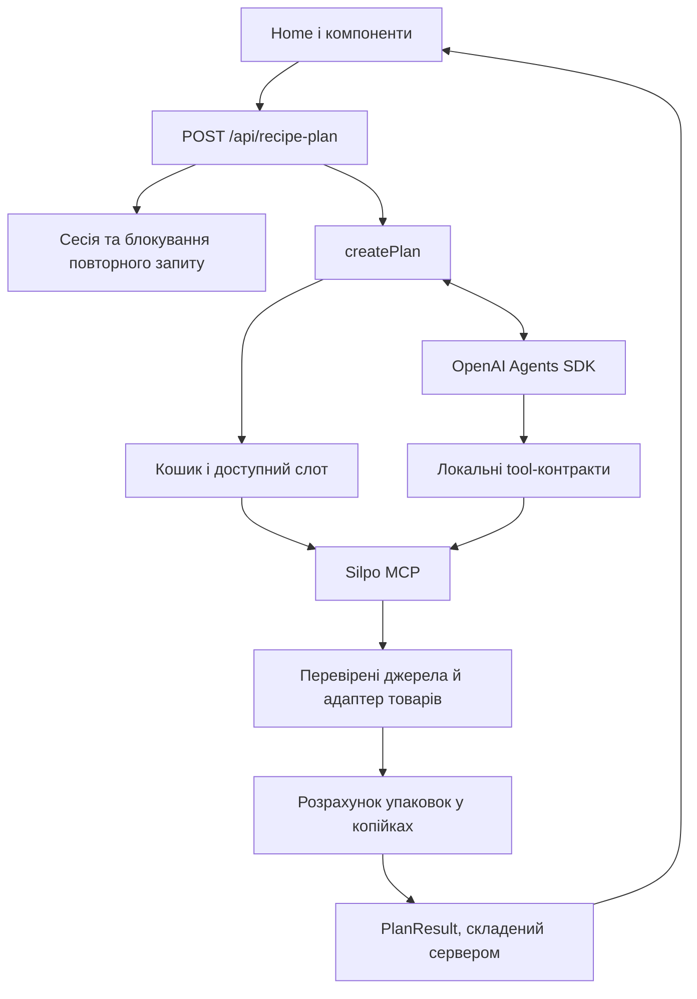

# Архітектура

## Межі застосунку

Один Next.js-проєкт містить український landing та Node.js API.
Браузер надсилає три поля форми; сервер працює з OpenAI й авторизованим Silpo MCP.
Один агент вибирає рецепт і товари, але авторизацію, допустимі інструменти,
нормалізацію каталогу та арифметику контролює код.

## Карта коду

| Шлях                                                    | Відповідальність                                                                                   |
| ------------------------------------------------------- | -------------------------------------------------------------------------------------------------- |
| [app/page.tsx](../src/app/page.tsx)                     | Стан форми, перевірка підключення, запит плану, прокручування до результату                        |
| [components/home](../src/components/home)               | Header, Hero, HowItWorks, Planner, RecipeResult, RecipeDetails, ShoppingList, ProductImage, Footer |
| [app/api](../src/app/api)                               | HTTP-валідація та маршрути OAuth                                                                   |
| [server/agent.ts](../src/server/agent.ts)               | Оркестрація агента, реєстрація товарів, оцінка й оптимізація                                       |
| [server/session.ts](../src/server/session.ts)           | Сесії в пам’яті й OAuth provider                                                                   |
| [server/mcp.ts](../src/server/mcp.ts)                   | Streamable HTTP, tools/list, декодування tool-відповідей                                           |
| [server/cart-context.ts](../src/server/cart-context.ts) | Кошик, перший shipment, перевірка слота                                                            |
| [lib/agent-policy.ts](../src/lib/agent-policy.ts)       | Контракти пошуку, проєкція каталогу, шляхи доказів, конфлікти призначень                           |
| [lib/silpo-product.ts](../src/lib/silpo-product.ts)     | Поточний типізований адаптер товарів                                                               |
| [lib/pricing.ts](../src/lib/pricing.ts)                 | Перетворення одиниць, упаковки, залишки, суми                                                      |
| [lib/contracts.ts](../src/lib/contracts.ts)             | PlanRequest, Recipe, Product, ShoppingLine, PlanResult і Zod-схеми                                 |

`groundProduct` у `lib/evidence.ts` та `groundContext` у
`lib/context-evidence.ts` — допоміжні механізми з окремими тестами. Поточна
оркестрація використовує `normalizeSilpoProduct` та `loadCartContext`; не
плутайте покриття допоміжних функцій із перевіркою активного шляху.

## Життєвий цикл плану

1. API перевіряє Origin, JSON, схему, сесію й `session.busy`.
2. `createPlan` відкриває MCP-клієнт, отримує tools/list та перевірений контекст
   кошика. Невалідний слот зупиняє запуск до звернення до моделі.
3. `define_recipe` приймає рецепт один раз, перевіряє унікальність ID й фіксує
   інгредієнти. До цього пошук товарів заблокований.
4. Модель викликає два дозволені catalog-tools. Сервер додає магазин і слот,
   перевіряє аргументи, зберігає очищене джерело під `sourceId`.
5. `register_products` читає товар за канонічним JSON Pointer, отримує деталі
   за slug, перевіряє ідентичність та створює `productKey`. Деталі кешуються
   за ID лише в межах поточного плану.
6. `evaluate_basket` зіставляє зареєстровані ключі з інгредієнтами. Невідомі ID,
   повторне призначення інгредієнта та один товар для різних назв відхиляються.
7. `calculate` формує покупки й перелік відсутнього. Найкращий варіант має
   спочатку менше відсутніх інгредієнтів, а за однакової кількості — меншу суму.
8. За неповного чи надто дорогого плану виконуються до трьох раундів оптимізації.
   Цикл завершується при повному плані в бюджеті або відсутності покращення.
9. Сервер будує `PlanResult` із зафіксованого рецепта й найкращого розрахунку;
   фінальний текст моделі не є HTTP-відповіддю. MCP-клієнт закривається в `finally`.

## Правила бюджету

- Купуються всі інгредієнти, включно зі спеціями й олією; водопровідна вода та
  доставка не входять у суму. Рецепт і кількості не змінюються під час оптимізації.
- Гроші в результаті — цілі копійки. `differenceKop = budgetKop - totalKop`:
  додатне значення означає залишок, від’ємне — перевищення.
- Потреби в одному товарі агрегуються до округлення. Купуються повні упаковки
  або вагова кількість із дотриманням `minOrder`, `orderStep` та `stock`.
- Перетворення дозволені лише в межах маси, об’єму чи кількості штук.
- Відсутні товари, URL, несумісні одиниці або недостатній залишок потрапляють у
  `missing`. Тоді сума описує лише підтверджену частину, статус — `incomplete`.
- `substitutions` порівнює вибір із першим повним кошиком; це не повна історія
  всіх спроб і не доказ глобально найнижчої ціни.

## Стан і обмеження

Сесії живуть у `globalThis` Map серверного процесу; стан пошуку — у локальних
Map виклику `createPlan`; результат — у React state. Перезапуск процесу скидає
авторизацію, оновлення сторінки — результат. Постійної БД та спільного сховища
між процесами немає. Поточна архітектура не призначена для serverless чи кількох
реплік без окремих змін зберігання, блокування й квот.

Детальні контракти — в [API](api.md), зовнішні залежності — в
[інтеграціях](integrations.md), обмеження довіри — у [безпеці](security.md).
